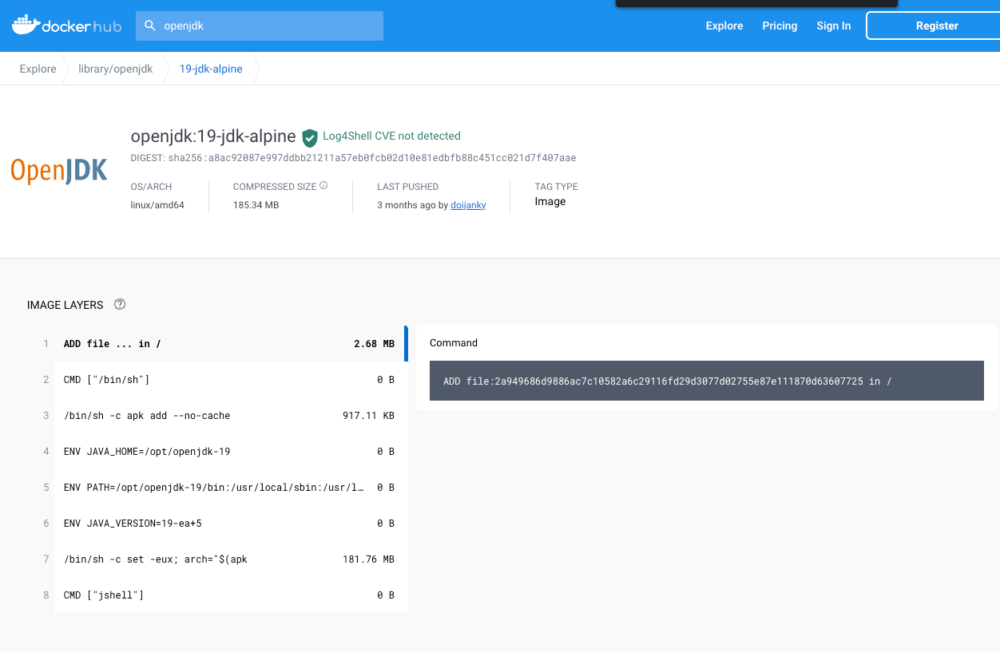

# Sprint Boot Hello World

https://spring.io/guides/gs/spring-boot/
https://spring.io/guides/gs/spring-boot-docker/

Build 
```shell
cd api/spring-boot/hello-world
./mvnw package
```

Run locally
```shell
java -jar target/demo-1-0.0.1-SNAPSHOT.jar
```

## Run via Docker

Pull Docker Image
```shell
docker pull openjdk:19-jdk-alpine
```

Build Docker Image
```shell
docker build -t springio/gs-spring-boot-docker .
```

Run docker image
```shell
docker run -p 8080:8080 springio/gs-spring-boot-docker 
```

Open `http://localhost:8080/hello`

## Apple Silicon
If you get the following error `failed to solve with frontend dockerfile.v0: failed to create LLB definition: no match for platform in manifest` it's basically because the Apple silicon platform build is not available for docker image `openjdk:19-jdk-alpine`



You can still build the docker image and run it by adding the following parameter to the docker commands `--platform linux/x86_64`

eg.
```shell
docker pull openjdk:19-jdk-alpine --platform linux/x86_64
```

```shell
docker build --platform linux/x86_64 -t springio/gs-spring-boot-docker .
```

```shell
docker run --platform linux/x86_64 -p 8080:8080 springio/gs-spring-boot-docker 
```
